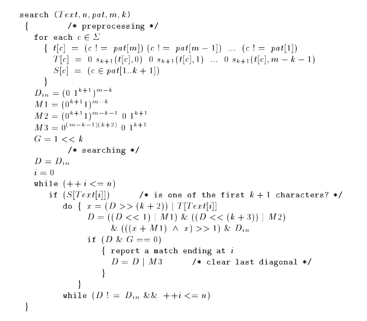

# [bitap](https://en.wikipedia.org/wiki/Bitap_algorithm)

[](https://travis-ci.org/tallesl/bitap)
[](https://coveralls.io/r/tallesl/bitap?branch=master)
[](https://david-dm.org/tallesl/bitap)
[](https://david-dm.org/tallesl/bitap#info=devDependencies)
[](http://badge.fury.io/js/bitap)

[](https://nodei.co/npm/bitap/)

Fuzzy string search algorithm that searches for a given *pattern* in a *text* respecting an amount of *errors* ([Levenshtein distance](https://en.wikipedia.org/wiki/Levenshtein_distance)).

It's a JavaScript implementation of the algorithm present in the paper [A Faster Algorithm for Approximate String Matching](http://dcc.uchile.cl/~gnavarro/ps/cpm96.pdf) by Ricardo Baeza Yates and Gonzalo Navarro:

[](lib/bitap.js)

## Usage

```javascript
$ npm install bitap
bitap@1.0.0 node_modules/bitap
$ node
> var bitap = require('bitap')
undefined
> bitap('where is my elephant', 'telephone', 3)
[ 18 ]
```
